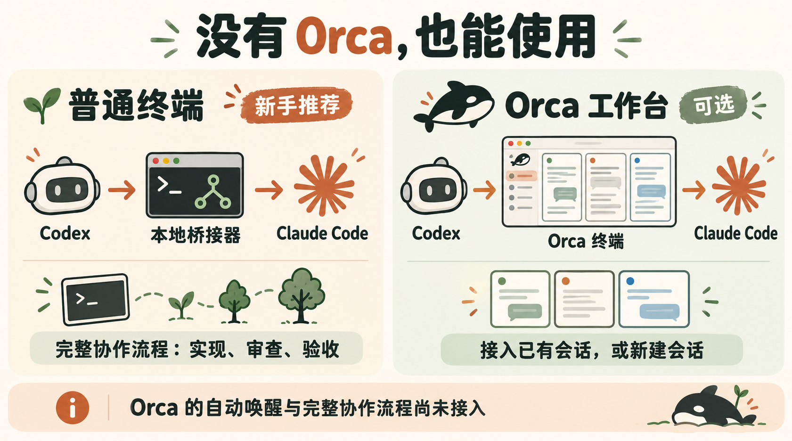

<div align="center">

# Codex × Claude Bridge

**把一个需求，变成有分工、有进度、有验收的 AI 协作任务。**

[](https://github.com/lordfine/codex-claude-bridge/releases/latest)
[](https://github.com/lordfine/codex-claude-bridge/actions/workflows/test.yml)
[](./LICENSE)

[第一次使用](./docs/快速开始.md) · [最佳实践](./docs/最佳实践.md) · [功能与限制](./docs/功能与限制.md)

</div>

## 这个项目有什么意义？

当你同时使用 Codex 和 Claude Code，常见的协作方式是：在一个窗口想方案，复制到另一个窗口执行，再把结果复制回来检查。本项目把这条沟通链接起来。

你告诉 Codex **目标、工作目录和验收条件**，它就能向 Claude Code 下达任务，读取进度，安排审查，核对实际改动，并继续修复或完成交付。

| 谁 | 负责什么 |
| --- | --- |
| **你** | 定义目标，决定有歧义的业务取舍 |
| **Codex** | 拆任务、关键决策、检查结果，也能亲自改代码 |
| **Claude Code** | 在指定范围实现代码、执行检查或做独立审查 |
| **本项目** | 提供本机通信、会话管理与协作流程，让双方能接上工作 |

执行模型默认沿用你当前的 Claude Code 配置。你可以结合 Codex 的规划能力与自己配置的执行模型；具体用量与成本需按实际运行观察，项目不承诺固定节省比例。

## 没有 Orca，能不能用？

**能。第一次使用建议直接选择普通终端，不需要安装 Orca。**

插件会创建自己的 Claude Code 可见窗口。新实现任务使用独立 Git 工作树，你可以看到 Claude 工作，Codex 可以串联实现、审查、返工和验收合并。

“工作树”可以理解成同一仓库的另一个工作目录与分支：Claude 先在里面实现，验收通过后再合并回目标分支。[详细实现范围](./docs/功能与限制.md)



*配图为 AI 生成的概念示意，不是实际软件截图。*

## Orca 是什么？为什么有人会安装它？

[Orca](https://www.onorca.dev/) 是一款面向 AI 编程代理的桌面工作台，将多个项目、终端、代码差异和 Git 工作树放在同一个界面中；可以在其中运行 Claude Code、Codex 等工具。[官方终端说明](https://www.onorca.dev/docs/terminal)

如果你经常开多个 AI 会话，或者已经在 Orca 里使用 Claude Code，它可以帮助你集中查看和管理这些窗口。本插件则通过 Orca 的 CLI 向其中的 Claude 终端发指令、读取结果。

**Orca 是可选的工作台，不是模型，也不是本项目必须依赖的软件。**

| 你的情况 | 建议 |
| --- | --- |
| 第一次体验 Codex 指挥 Claude | 用普通终端，先跑通一个小任务 |
| 想使用完整的实现 → 审查 → 验收流程 | 用普通终端托管路径 |
| 已有 Claude 会话在 Orca 中运行 | 用 Orca 接入路径，空闲时按 UUID 接手 |
| 想从 Codex 在 Orca 中再开一个 Claude | 用 Orca 新建路径 |

需要 Orca 时再从 [官网](https://www.onorca.dev/) 安装。它自身能管理工作树，不代表本插件的 Orca 后端已经接上所有协作能力。

## 现在能做到什么程度？

| 能力 | 普通终端托管 | Orca 终端 |
| --- | --- | --- |
| 新建可见 Claude 会话、发任务、读进度和结果 | 已实现 | 已实现 |
| 接回已有会话 | 原 Claude 进程退出后续接 | 空闲时直接接入，无须退出原进程 |
| 独立工作树、独立审查、返工、验收合并 | 已实现 | 尚未接入；在给定工作区执行 |
| 默认并发 3、最高 10，超额排队 | 已实现，按 Codex 主控任务计算 | 尚未接入统一配额 |
| 时间与主会话轮数预算 | 已实现，可调整 | 尚未接入 |
| Claude 完成后触发 Codex CLI 续接 | 已实现 | 尚未接入 |
| 人类操作与权限处理 | 插件门禁与 `/交还` | 保持原会话权限与 Orca 钩子 |

Windows 是优先实机验证平台。自动检查覆盖 91 项，迁移版保留 22 个公开工具；原打开 Codex 桌面窗口即时刷新、长期并发和远程 Orca 等场景仍需验证。[验证口径与限制](./docs/功能与限制.md)

## 怎么开始？

先准备：**Codex、Claude Code、Node.js 20+、Git**。本文安装命令使用 Codex CLI；Windows 普通终端窗口还需要 **Windows Terminal、PowerShell 7**。Claude Code 必须已能使用你的当前登录或模型配置工作。

```powershell
git clone https://github.com/lordfine/codex-claude-bridge.git
cd codex-claude-bridge
codex plugin marketplace add .
codex plugin add claude-code@codex-claude-bridge
```

安装后重新加载 Codex 插件／MCP 实例，让 Codex“检查 Claude 协作插件环境”。首次准备终端需要本机 npm 下载依赖。[完整准备步骤与排查](./docs/快速开始.md)

**第一次先做一个小任务：**

> 工作区是〈一个已保存当前改动的 Git 仓库绝对路径〉。请通过普通终端让 Claude 只修改 README，补充项目环境准备说明。不要改业务代码。你检查改动并告诉我结果，先不要合并。

之后再尝试：

> 让 Claude 在独立工作树实现〈目标〉，安排独立审查，满足〈验收条件〉后合并。遇到业务取舍先问我。

你无需记住工具名称或编写 MCP 参数；插件技能指导 Codex 选择对应入口。

## 几条值得先记住的最佳实践

1. **任务写清楚**：目标、允许修改的范围、验收条件，比一句“把它优化一下”更容易交付。
2. **先单任务，再并行**：拆分能独立实现的工作；多人改同一文件时交替操作。
3. **先验证当前模型能独立工作**：插件继承配置，不帮你切换 CCswitch 或修复供应商连接。
4. **检查实际改动**：Claude 说完成、终端显示空闲，都不能代替验收。
5. **后台续接先走普通终端路径**：目前 Orca 后端尚未接入自动唤醒。

[完整最佳实践与可复制任务模板](./docs/最佳实践.md)

## 文档与反馈

| 文档 | 适合什么时候看 |
| --- | --- |
| [快速开始](./docs/快速开始.md) | 第一次安装、首次任务、常见问题 |
| [最佳实践](./docs/最佳实践.md) | 任务分派、并行、模型、交接与验收 |
| [功能与限制](./docs/功能与限制.md) | 核对已实现、已验证与尚未接入的能力 |
| [开发指南](./docs/开发指南.md) | 修改代码、运行检查或发布版本 |

问题与建议通过 [Issues](https://github.com/lordfine/codex-claude-bridge/issues) 提交，附版本与脱敏复现步骤。

独立维护，采用全新提交历史。沿用源码的版权与 [MIT 许可](./LICENSE) 保留；见 [项目来源](./docs/项目来源.md)。
